<div align="center">

  <!-- Animated SVG Hero Banner -->
  

  <br/><br/>

  <!-- Animated Typing SVG Header -->
  <a href="https://github.com/readme-typing-svg">
    
  </a>

  <p align="center">
    <strong>Empowering agricultural supply chains to reduce food waste through computer vision, algorithmic surplus discount routing, and verified QR passports.</strong>
  </p>

  <!-- Animated Badges & Status Shields -->
  <p align="center">
    
    
    
    
    
  </p>

</div>

---

## ⚡ The Circular Supply Chain Pipeline

<div align="center">
  
</div>

<br/>

```
  🍎 Raw Produce       🤖 Vision Transformer       🏷️ Auto-Grading       🛒 Rescue Marketplace       📦 Public Passport
 ┌──────────────┐     ┌──────────────────────┐    ┌─────────────────┐    ┌────────────────────┐    ┌───────────────────┐
 │ Harvested    │ ──► │  ResNet-50 Detector  │ ─►│ Brix / Shelf    │ ─► │ 15%-60% Off        │ ─► │ Cryptographic QR  │
 │ Fresh Crop   │     │  42ms Classification │    │ Life Metric     │    │ Surplus Dispatch   │    │ Verified Passport │
 └──────────────┘     └──────────────────────┘    └─────────────────┘    └────────────────────┘    └───────────────────┘
```

---

## 🌟 Key Application Modules

<details open>
<summary><h3>1. 📸 Vision AI Scanner & Quality Assessment (<code>/scan</code>)</h3></summary>

- **Instant Quality Classification**: Drag-and-drop produce photos, connect live mobile cameras, or inspect pre-loaded samples.
- **Model Attribution**: Powered by [`jazzmacedo/fruits-and-vegetables-detector-36`](https://huggingface.co/jazzmacedo/fruits-and-vegetables-detector-36) (ResNet-50 fine-tuned on 36 produce categories via Hugging Face 🤗).
- **Metric Extraction**: Automatically calculates **Freshness Index Score (%)**, **Remaining Shelf-life (Days)**, **Sugar Brix Index**, and **Carbon Offset Potential (kg CO₂)**.
- **One-Click Actions**:
  - 🛡️ **Save Batch to ERP System**: Registers produce batch in SQLite database.
  - ⚡ **Auto-List on Rescue Exchange**: Auto-lists near-expiry batches at algorithmic discounts (e.g. 30% off).
</details>

<details open>
<summary><h3>2. 🏬 Near-Expiry Rescue Marketplace (<code>/marketplace</code>)</h3></summary>

- **Algorithmic Rescue Exchange**: Direct B2B/B2C marketplace connecting eco-farms with restaurants, juice bars, and buyers.
- **Real-Time Dynamic Filters**: Search by produce name, grower location, or set a maximum expiry window filter (`≤ 1 to 7 days`).
- **Escrow Claiming**: One-click claim flow triggering backend escrow lock (`POST /listings/{id}/claim`).
</details>

<details open>
<summary><h3>3. 📊 ERP Intelligence Hub & Prescriptive AI (<code>/dashboard</code>)</h3></summary>

- **Animated Metric Cards**: Live counter tracking Total Batches Tracked, Freshness Ratio %, Produce Waste Saved (kg), and Salvaged Capital Revenue ($).
- **Prescriptive AI Assistant**: Detects near-expiry inventory spikes and alerts growers with auto-discount recommendations.
- **Inventory Management**: Full table view of farm inventory with status updates.
</details>

<details open>
<summary><h3>4. 📦 Public QR Traceability Passport (<code>/track/[batchId]</code>)</h3></summary>

- **Scannable Verification**: Generates PNG QR codes (`GET /batches/{batchId}/qr`) for physical produce packaging.
- **Audited Supply Chain Timeline**: Publicly accessible passport showing farm origin, harvest date, temperature logs, and cryptographic certificate hash (`0x...`).
</details>

---

## 🚀 Quick Start (Local Setup)

### Option A: One-Click PowerShell Launcher (Recommended)

Run the automated local launcher from the project root:
```powershell
.\run-local.ps1
```

---

### Option B: Manual Process Start

#### Terminal 1 — Start Python FastAPI Backend (Port `8000`)
```powershell
cd Backend/phase6
..\phase0\venv\Scripts\python.exe -m uvicorn main:app --reload --port 8000
```
> **Backend Health Check:** Visit [`http://127.0.0.1:8000/health`](http://127.0.0.1:8000/health) or Interactive API Docs at [`http://127.0.0.1:8000/docs`](http://127.0.0.1:8000/docs).

#### Terminal 2 — Start Next.js Frontend (Port `3000`)
```powershell
cd Frontend
npm run dev
```
> **Web Application:** Open [`http://localhost:3000`](http://localhost:3000) in your web browser.

---

## 📡 API Endpoint Overview

| Method | Path | Target | Description |
| :--- | :--- | :--- | :--- |
| `GET` | `/health` | Ops | FastAPI service liveness & ML model status |
| `POST` | `/predict/upload` | ML Engine | Run Vision Transformer on uploaded image file |
| `POST` | `/predict/url` | ML Engine | Run Vision Transformer on image URL |
| `GET` | `/listings` | Marketplace | Fetch near-expiry surplus produce listings |
| `POST` | `/listings/{id}/claim` | Escrow | Claim a listed produce batch |
| `GET` | `/erp/stats` | ERP Hub | Fetch circular economy metrics & waste saved |
| `GET` | `/batches/{id}/qr` | QR Passport | Generate scannable PNG QR code for produce packaging |
| `POST` | `/demo/seed` | Safety Net | Re-seed 6-step walkthrough demo database |

---

## 🧪 Verification & Automated Testing

To run the full end-to-end backend test suite:
```powershell
cd Backend/phase6
..\phase0\venv\Scripts\python.exe test_phase6.py
```

To run Next.js production build and TypeScript verification:
```powershell
cd Frontend
npm run build
```

---

<div align="center">
  <p>Made with 💚 for Sustainable Agriculture & Zero Food Waste</p>
</div>
